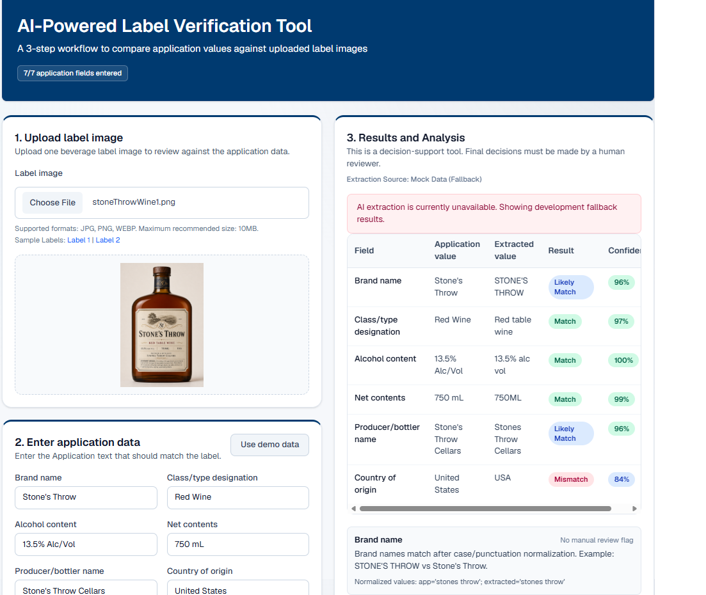

# AI-Powered Label Verification Tool (Evaluation Prototype)

This repository contains a functional standalone prototype designed to evaluate how artificial intelligence can streamline the compliance review workflow for federal beverage label applications.

**Live System URL:** `https://ttb.myappnow.net`  
**Core Specification:** [Product Requirements Document](docs/PRD.md)

## 🎯 Summary

This system serves as a **Human-in-the-Loop Decision Support Tool**. It automates the repetitive extraction and textual tasks, highlighting discrepancies so human compliance experts can focus on complex edge-case evaluations and final determinations.

## 🏗️ Technical Architecture & Design Decisions

The prototype is built utilizing a modern, decoupled, and lightweight architecture designed for rapid iteration and transparent execution.

### Architectural Blueprint
* **Frontend & Application Core:** Next.js (App Router) & TypeScript for static typing, predictable state management, and high-performance server-side rendering capability.
* **Styling & Interface:** Tailwind CSS configured with a high-contrast palette (utilizing Federal Blue primary schemes) to align with baseline **Section 508 Accessibility** principles.
* **AI Orchestration Layer:** Native Integration with OpenAI's Vision-capable API models via a secure serverless API Route (`app/api/extract/route.ts`).
* **Data Strategy:** To maximize delivery speed for this sprint, the prototype operates as an **In-Memory Pipeline**. It does not bind to a persistence layer (Database), mitigating early-stage infrastructure friction.
---

## ⚖️ Engineering Tradeoffs & Prioritization

To have the prototype within the evaluation timeline, below are the key architectural tradeoffs:
| Architectural Focus  | Implementation Strategy                                |
| **Data Persistence** | In-memory execution; no database or session caching.   | 
| **Identity Access**  | Publicly accessible endpoint; no authentication layer. | 
| **Data & Scope**     | Prioritizing a single-image and single-application workflow allows validation of the AI vision' and core logic, can later add complexity like concurrent scaling or batch processing |
---

## How this App works

1. Click "Choose File" to **upload a label image** (alcohol beverage label).
2. Enter **Application Values** manually (or click to load demo data, e.g. Brand Name = Stone's; Net contents=750 mL ...etc).
3. Click **"Run analysis"**
4. The App will compare extracted values (from the uploaded image) against submitted values (Application Values).
5. **Results pane**: will show field-by-field comparison and its result, e.g. matched, not matched, need human review..etc.

If extraction is unavailable, the app can fall back to mock extracted values in non-production (or when forced by env var).
The extraction route reads model output from the OpenAI Responses API path output[0].content[0].text and parses it into the extracted-field contract used by the app.
This app is a decision-support to the human agent only, the agent makes final decision.

## Extracted/comparison fields

- Brand name
- Class/type designation
- Alcohol content
- Net contents
- Producer/bottler name
- Country of origin
- Government warning statement

## To run this App locally in development environment
Follow these steps to spin up the local development server.

### Prerequisites
* Node.js (v22.x or higher recommended)
* npm v10.x

### 1. Clone & Install Dependencies
**Bash or cmd prompt:**
git clone https://github.com/pnguyenV/ttb-label-verifier.git
cd ttb-label-verifier
npm install

### 2. Configure Environment Variables 
Create .env.local file in the project root if not already exists
Replace your_openai_api_key_here with a valid OpenAI API key:  OPENAI_API_KEY=your_openai_api_key_here

**Note**: the application requires a valid OpenAI API key and internet connectivity to perform OCR and label validation functions.

### 3. Start the development server:
npm run dev
Open the application on your browser http://localhost:3000.

## Validation commands
npm run test
npm run lint
npm run build

## Manual QA flow

1. Click Use demo data or enter custom text.
2. Upload any sample label image.
3. Click Run analysis.
4. Confirm comparison rows show Match, Likely Match, Mismatch, Missing, or Needs Human Review.
5. Confirm Government Warning Validation shows:
- Pass/Fail status
- Confidence percentage
- Exact warning text check
- Uppercase GOVERNMENT WARNING check
- Validation notes

If extraction fails while fallback is allowed, confirm a user-facing fallback message appears and results still render.

## API keys and environment

Real extraction requires an OpenAI API key.

Environment variables:
- OPENAI_API_KEY: required for real AI extraction
- OPENAI_VISION_MODEL: optional model override (route default is gpt-4.1-mini)
- NEXT_PUBLIC_USE_MOCK_EXTRACTION: optional; set true to force mock fallback mode

Behavior:
- Production expects real extraction (valid OPENAI_API_KEY).
- Non-production allows mock fallback if extraction fails.

## Technology stack

- Next.js App Router
- TypeScript
- React
- Tailwind CSS
- Vitest
- App Router API route for extraction: app/api/extract/route.ts
- OpenAI Responses API (vision-capable model)
- Mock extracted-data fallback for development
- No authentication
- No database

## Project structure

app/
- page.tsx
- api/extract/route.ts

components/
- UploadForm.tsx
- UploadSection.tsx
- ApplicationForm.tsx
- ResultsPanel.tsx
- WarningValidationCard.tsx
- WarningCheckCard.tsx

lib/
- normalize.ts
- compare.ts

utils/
- normalization.ts
- comparison.ts

types/
- label.ts

data/
- mockData.ts
- mockExtractedLabel.ts

## Deployment

This repository is Vercel-friendly and can be deployed directly as a standard Next.js application.
